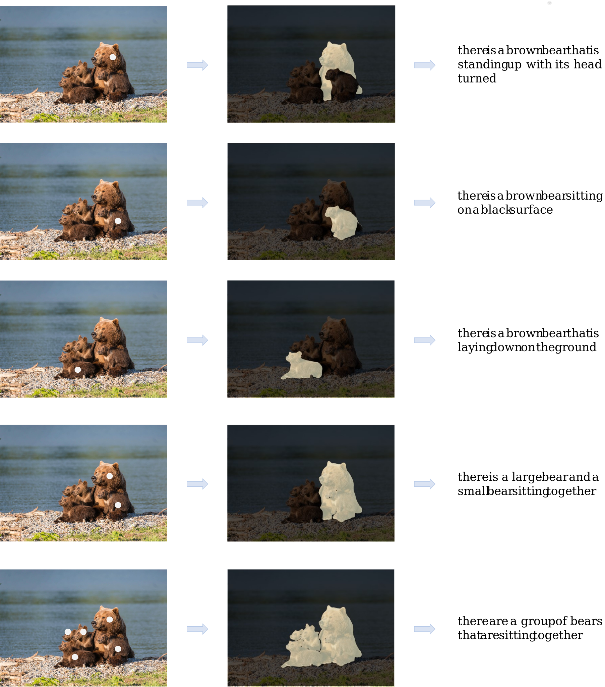

# Caption-Anything
<!--  -->
**Caption-Anything** is a versatile image processing tool that combines the capabilities of [Segment Anything](https://github.com/facebookresearch/segment-anything), Visual Captioning, and [ChatGPT](https://openai.com/blog/chatgpt). Our solution generates descriptive captions for any object within an image, offering a range of language styles to accommodate diverse user preferences. **Caption-Anything** supports visual controls (mouse click) and textual controls (length, sentiment, factuality, and language).

<a src="https://img.shields.io/badge/%F0%9F%A4%97-Open%20in%20Spaces-blue" href="https://huggingface.co/spaces/wybertwang/Caption-Anything">
    
</a>
<!-- <a src="https://colab.research.google.com/assets/colab-badge.svg" href="">
    
</a> -->

### Demo
Explore the interactive demo of Caption-Anything, which showcases its powerful capabilities in generating captions for various objects within an image. The demo allows users to control visual aspects by clicking on objects, as well as to adjust textual properties such as length, sentiment, factuality, and language.
<div align=left>

</div>

---

<div align=center>

</div>

### Getting Started

To start using Caption-Anything, follow these steps:
* Clone the repository:
```bash
git clone https://github.com/tengwang/caption-anything.git
```
* Install dependencies:
```bash
cd caption-anything
pip install -r requirements.txt
```
* Set up and configure the necessary APIs and modules
```bash
export OPENAI_API_KEY={Your_Private_Openai_Key}
```
* Run the Caption-Anything gradio demo.
```bash
python app.py --regular_box  --port 6086
```


