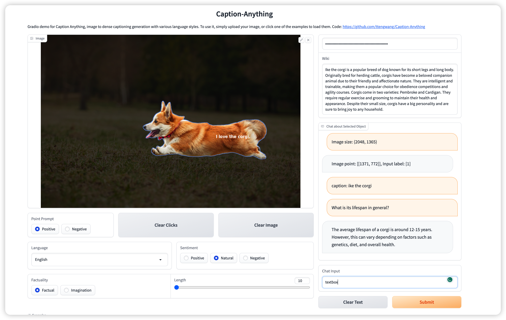
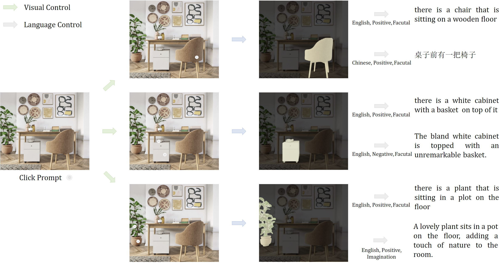
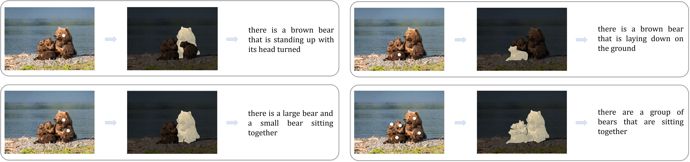

<div align="center">
<h1 align="center"> Caption Anything </h1>
<a src="https://img.shields.io/badge/%F0%9F%A4%97-Open%20in%20Spaces-blue" href="https://huggingface.co/spaces/TencentARC/Caption-Anything">
    
</a>
<a src="https://colab.research.google.com/assets/colab-badge.svg" href="">
    
</a>
</div>

<div align=center>

</div>
<center> <font color=grey>Along the River During the Qingming Festival (清明上河图)</font></center>


**Caption-Anything** is a versatile image processing tool that combines the capabilities of [Segment Anything](https://github.com/facebookresearch/segment-anything), Visual Captioning, and [ChatGPT](https://openai.com/blog/chatgpt). Our solution generates descriptive captions for any object within an image, offering a range of language styles to accommodate diverse user preferences. 

**Caption-Anything** supports visual controls (mouse click) and language controls (length, sentiment, factuality, and language).
* Visual controls and language controls for text generation
* Chat about selected object for detailed understanding
* Interactive demo

### Updates
* 2022/04/13: add huggingface demo <a src="https://img.shields.io/badge/%F0%9F%A4%97-Open%20in%20Spaces-blue" href="https://huggingface.co/spaces/TencentARC/Caption-Anything"> </a>
* 2022/04/12: Release code

### Demo
Explore the interactive demo of Caption-Anything, which showcases its powerful capabilities in generating captions for various objects within an image. The demo allows users to control visual aspects by clicking on objects, as well as to adjust textual properties such as length, sentiment, factuality, and language.

---



---



---



### Getting Started
```bash
# Clone the repository:
git clone https://github.com/ttengwang/caption-anything.git
cd caption-anything

# Install dependencies:
pip install -r requirements.txt

# Download the [SAM checkpoints](https://dl.fbaipublicfiles.com/segment_anything/sam_vit_h_4b8939.pth).
wget https://dl.fbaipublicfiles.com/segment_anything/sam_vit_h_4b8939.pth ./segmenter/sam_vit_h_4b8939.pth

# Configure the necessary ChatGPT APIs
export OPENAI_API_KEY={Your_Private_Openai_Key}

# Run the Caption-Anything gradio demo.
python app.py --captioner blip2 --port 6086
```

## Usage
```python
from caption_anything import CaptionAnything, parse_augment
args = parse_augment()
visual_controls = {
    "prompt_type":["click"],
    "input_point":[[500, 300], [1000, 500]],
    "input_label":[1, 0], # 1/0 for positive/negative points
    "multimask_output":"True",
    }
language_controls = {
    "length": "30", 
    "sentiment": "natural", # "positive","negative", "natural"
    "imagination": "False", # "True", "False"
    "language": "English" # "Chinese", "Spanish", etc.
    }
model = CaptionAnything(args, openai_api_key)
out = model.inference(image_path, visual_controls, language_controls)
```

## Acknowledgements
The project is based on [Segment Anything](https://github.com/facebookresearch/segment-anything), BLIP/BLIP-2, [ChatGPT](https://openai.com/blog/chatgpt). Thanks for the authors for their efforts.

## Contributor

<a href="https://github.com/ttengwang/Caption-Anything/graphs/contributors">
  
</a>